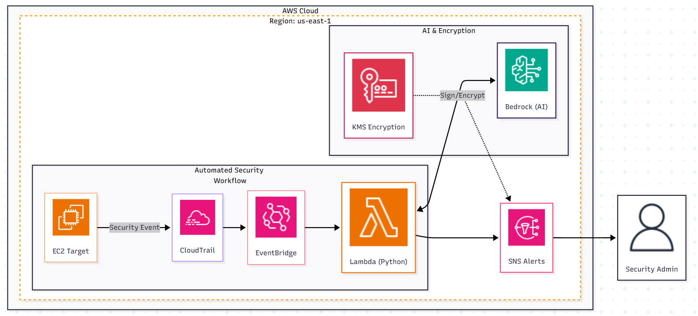

# GuardianAI: Event-Driven Cloud Security Auditor 

## Project Overview
GuardianAI is a business-focused security solution that bridges the gap between technical cloud logs and actionable leadership insights. It automates the analysis of AWS infrastructure changes by leveraging Generative AI to provide instant, context-aware risk assessments.

### Business Value
* **Operational Efficiency:** Automates the initial triage of security incidents.
* **Risk Mitigation:** Identifies "shadow IT" and high-risk port openings (e.g., SSH/0.0.0.0) in seconds.
* **Human-Centric Design:** Translates complex JSON event data into clear, professional summaries for stakeholders.

---

## Architecture

> **Note:** The system is built on a serverless, event-driven backbone in the `us-east-1` region, ensuring scalability and cost-optimization.

---

## The Tech Stack
* **Cloud Infrastructure:** AWS (EventBridge, Lambda, SNS, CloudTrail)
* **Intelligence Engine:** Amazon Bedrock (Claude 3 Haiku)
* **Infrastructure as Code:** Terraform (HCL) for automated, repeatable deployment.
* **Security & Governance:** AWS KMS (Encryption), IAM (Least Privilege Policies)
* **Language:** Python 3.12

---

## Key Technical Features
1. **IaC Deployment:** Project is fully modularized using Terraform, ensuring consistent environment state and simplified resource lifecycle management.
2. **Docs-as-Code:** Architecture designed and maintained using Mermaid.js.
3. **Zero-Trust Security:** Implemented "Least Privilege" IAM roles, restricting the AI module's access to specific Bedrock models only.
4. **Encrypted Alerting:** Integrated AWS KMS to ensure security notifications are encrypted in transit.

---

## Repository Contents
* `src/lambda_function.py`: Core logic for event processing and AI orchestration.
* `infrastructure/main.tf`: Terraform configuration for full environment automation.
* `infrastructure/iam_policy.json`: Security-first IAM execution role definition.
* `infrastructure/event_pattern.json`: EventBridge rule configuration for Security Group monitoring.

---

## Lessons Learned
* Managed API latency challenges by optimizing AWS Lambda timeouts for LLM responses.
* Engineered custom system prompts to ensure the AI output remains focused on NIST security frameworks.
